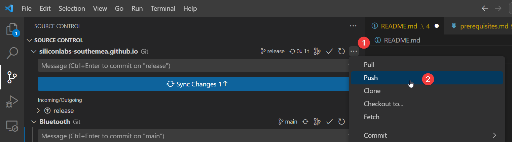

# South Europe FAE Team Documentation

To contribute to this documentation repo :

```bash
git clone https://github.com/siliconlabs-southemea/siliconlabs-southemea.github.io.git
cd siliconlabs-southemea.github.io
git submodule update --init
git submodule foreach git checkout main
```

Contribution Flow for Collaborators :

1. Always Pull-Rebase repos prior to any push
   If git reports an error, uncommit the last one an pull
   Re-commit
2. Stage only the files that you have been working on
3. Push

On VSCode Source Conrtol this results in :

Initial Pull on all Submodules


Stage individual changes you have been working on


Commit your staged changes and **add a message** :


Push or Sync your changes :


